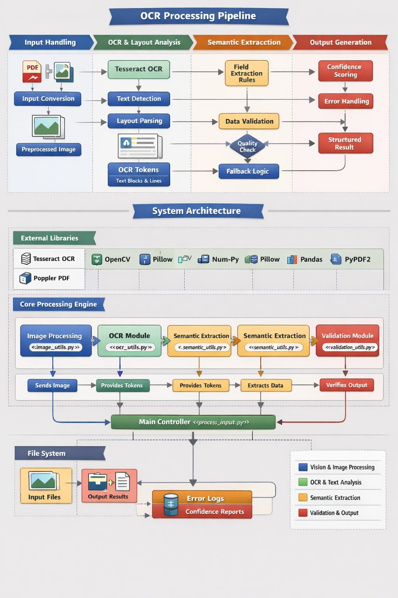

# Tractor Document OCR System

## Overview
This repository implements an **offline, rule-based OCR system** for extracting structured information from scanned tractor-related documents.  
The system is intentionally designed to be **deterministic, interpretable, and cost-free**, avoiding deep learning models and external services.

It is suitable for **academic evaluation**, **fintech document verification**, and **government-style audit workflows** where transparency and reproducibility are critical.

---

## Core Features
- Offline, CPU-only execution  
- Classical computer vision + OCR (no deep learning)  
- Multilingual text recognition (English + Hindi)  
- Layout-aware field extraction  
- Signature and stamp detection  
- Confidence-based output scoring  
- Structured JSON output  

---

## System Architecture

The system follows a **layered document understanding architecture**:

1. **Input Layer** – Image and PDF ingestion  
2. **Vision Processing Layer** – Grayscale conversion, thresholding, noise removal  
3. **OCR Layer** – Text extraction with spatial metadata  
4. **Layout Reasoning Layer** – Header, body, footer segmentation  
5. **Semantic Extraction Layer** – Dealer, model, horsepower, cost extraction  
6. **Authenticity Validation Layer** – Signature and stamp detection  
7. **Output Layer** – Confidence scoring and JSON generation  

Each layer is independent, testable, and explainable.

---

## Processing Pipeline

1. Document ingestion (image / PDF)  
2. Image preprocessing  
3. OCR execution with confidence filtering  
4. Layout segmentation  
5. Field-level semantic extraction  
6. Signature and stamp detection  
7. Confidence score computation  
8. Structured JSON output  

The pipeline is **sequential and deterministic**, ensuring consistent results across runs.

---

## Utilities Design
All reusable logic is modularized under the `utils/` directory.

**Design principles:**
- Single-responsibility utilities  
- Stateless processing  
- Clear separation of vision, OCR, and logic  
- Easy extensibility and evaluation  

---

## Requirements & Dependencies
Only **lightweight, open-source, CPU-based libraries** are used:

- **OpenCV** – Image preprocessing and contour analysis  
- **Tesseract OCR** – Multilingual OCR (EN + HI)  
- **NumPy** – Numerical operations  
- **PDF2Image** – PDF to image conversion  
- **RapidFuzz** – Fuzzy text matching  
- **Pillow** – Image handling and diagram support  

No cloud services or proprietary components are required.

---

## Cost Analysis
- Cloud cost: **₹0**  
- Inference cost: **₹0 per document**  
- Hardware: Standard CPU  
- Licensing: Fully open-source  

---

## Output
Each document produces a structured JSON containing:
- Extracted fields  
- Bounding boxes  
- Signature and stamp indicators  
- Overall confidence score  

---

## Limitations & Assumptions
- Assumes reasonably scanned documents (extreme blur or rotation may degrade accuracy)  
- Heuristic-based extraction is domain-specific and may require rule updates for new formats  
- Signature and stamp detection is presence-based, not identity verification  
- OCR accuracy depends on scan quality and font clarity  

These trade-offs are intentional to preserve **interpretability, determinism, and low cost**.

---

## Intended Use
- Academic submissions and demonstrations  
- Fintech and lending document verification  
- Government or institutional OCR workflows  
- Offline batch document processing  
